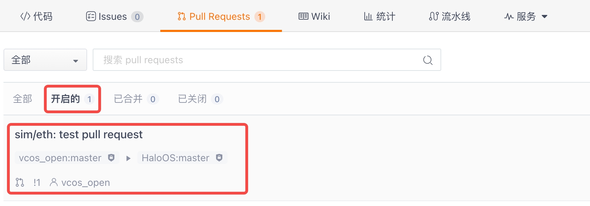

# 贡献流程
非常欢迎您加入**HaloOS**开源社区，为此项目的持续改进做出自己的贡献。
此开源项目遵循Apache License 2.0许可证协议。

## 1. 签署贡献者许可协议
为了避免开源许可证协议冲突或侵犯他人知识产权， 您在贡献代码和文档前，需要签署贡献者许可协议(Contributor License Agreement， CLA)，以确保您贡献的代码或文档
是自己原创，或引用的第三方代码不与Apache License 2.0协议冲突。

CLA 签署页面: [Gitee CLA（开源贡献者协议）签署页面](https://gitee.com/organizations/haloos/cla/haloos_cla)

检查CLA签署状态: [Gitee 我签署的 CLA（开源贡献者协议）页面](https://gitee.com/profile/clas)

## 2. 环境准备
为了顺利参与项目贡献，您需要提前准备必要的贡献工具
1. git，此项目使用git管理代码和文档变更，如果您的电脑没有预置git工具，请根据您的电脑系统下载对应的git工具，https://gitee.com/help/categories/43。
2. ssh公钥设置，下载项目代码可以使用https协议和ssh协议，由于https协议下载每次都需要输入密码，比较繁琐。 推荐使用ssh协议下载仓库代码，需要预先设置ssh公钥，
具体设置步骤可参考 https://gitee.com/help/categories/38。

## 3. 总体流程
贡献的总体流程预览如下图


## 4. 查找仓库
由于此项目采用多仓库的管理方式， 请先在项目的首页中查找您准备参与贡献的仓库和分支（默认为master分支）。

下面以`vcos_drivers`仓库为例说明贡献流程

## 5. Fork仓库与下载
1. 在此项目的仓库页面右上角点击Fork按钮，Fork到自己账号下，如图所示


2. Fork到自己账号后，下载自己账号下的仓库并做修改和提交。


## 6. 修改并提交到自己账号下仓库
在自己的代码仓库下修改代码，并做提交
```bash
git add .  # 添加自己的修改文件
git commit -s # 确认自己的修改提交，并添加Signed-off-by，注意邮箱需和签署CLA的邮箱地址一致
git push origin master # 推送到自己账号下仓库，master分支（可按需修改）
```
## 7. 请求合入代码或文档
### 7.1. 创建Pull Request
在自己仓库的Pull Request页面，点击`新建 Pull Request`按钮，


源分支填写自己账号下的仓库和分支，目标分支选择HaloOS开源仓库和分支。

### 7.2. 填写Pull Request信息
在gitee的Pull Request页面，选择好源分支和目标分支后，gitee会自动检测到您的修改.
点击`提交记录`或`文件改动`确认修改后，根据模板填写完善的Pull Request描述，
良好的Pull Request描述，有助于Pull Request 快速审核和合并。


确认无误后，点击`创建 Pull Request`按钮最终创建Pull Request

### 7.3. 确认Pull Request和参与讨论
在创建过Pull Request之后，可以在目标仓库和分支找到自己创建过的Pull Request


点击自己的Pull Request可以看到社区的评论和具体的状态。您可以添加自己的评论或回复别人的评论。


当Pull Request通过所有检查和review后，如果被社区接受，会被合并到目标仓库和分支。


至此，一个完整的代码或文档贡献就已经完成了，非常感谢您对我们开源项目的贡献！

### 7.4. 轻量级Pull Request
如果只是对文档或代码最简单的修改， 可以在gitee页面中发起轻量级Pull Request完成贡献。
**请确保你的修改可以通过测试**

在代码或文档的gitee浏览页面， 点击右上角的`编辑`按钮，进入在线编辑页面。


编辑后补充`完善信息`和`扩展信息`。为了让reviewer能很好地理解您的Pull Request，请提供尽可能详细的信息，包括为什么修改，如何修改的，通过的测试。


最后点击`提交审核`按钮，发起Pull Request，结果如图所示


## 8. 提交缺陷和请求新特性
### 8.1. 提交缺陷
如果您发现项目有非安全相关的缺陷，可以在gitee 相关仓库的`Issues`页面新建Issue，选择`缺陷`类型，并根据模板详细描述缺陷发生的环境，复现步骤，和报错信息。
同时也欢迎您对缺陷直接修改，并根据上面指引提交Pull Request。


### 8.2. 请求新特性
如果您对项目有好的特性建议，可以在gitee 相关仓库的`Issues`页面新建Issue，选择`需求`类型，并根据模板详细描述特性解决什么问题。
同时也欢迎您对实现新特性，并根据上面指引提交Pull Request。


## 9. 安全漏洞
如果您发现安全漏洞，请**不要**提公开Issue，请点击[理想安全应急响应中心](https://security.lixiang.com/index)上报安全漏洞。

## 10. 感谢
感谢您对此开源项目的贡献！
如果您对此项目感兴趣，想要关注进展，可以点击仓库页面右上角的`Watching`按钮。


如果您喜欢此项目，可以在对应仓库页面的右上角，点击`Star`按钮。

