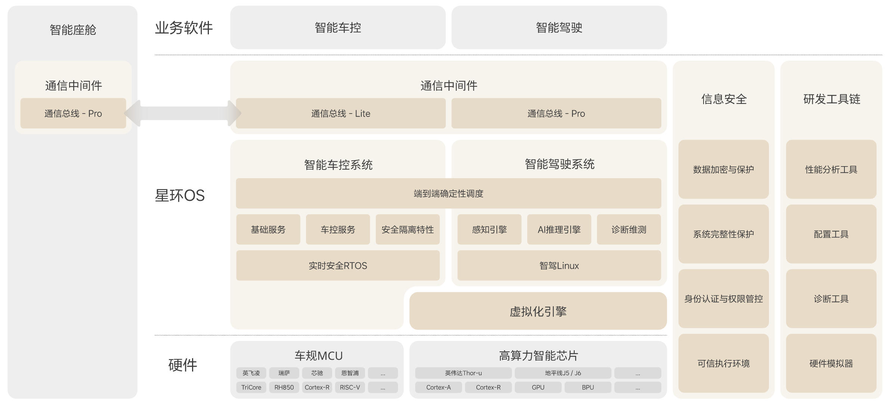
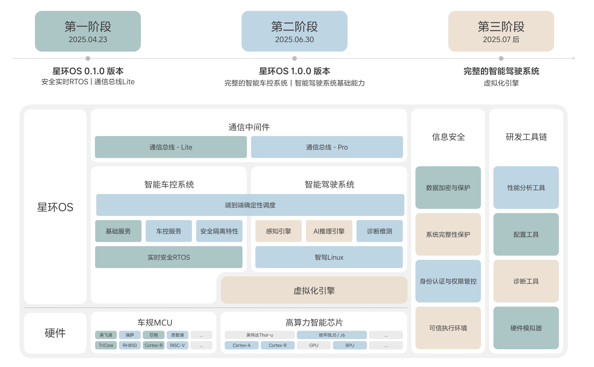

# 理想星环OS开源项目介绍

## 1. 简介
**理想星环OS（LiAuto HaloOS）** 是理想汽车自主研发的整车级开源操作系统，作为智能汽车全域协同的核心技术底座，成为智能汽车时代操作系统的新范式。通过开源架构与全栈自研能力，理想星环OS突破传统闭源系统的技术边界，构建起覆盖车载计算、通信、控制的全域技术生态，实现智能汽车操作系统从功能固化到灵活演进的代际跨越

在技术架构层面，理想星环OS基于全域协同计算模型实现系统级优化，其跨域调度能力使“感知-决策-执行”链路的响应效率提升1倍、稳定性提高5倍。以主动安全场景为例，系统在120km/h高速工况下可将AEB刹停距离缩短7米，同时通过多模块协同控制实现悬架响应速率与车身姿态控制精度提升73%。安全设计上，系统集成软硬一体化防护架构，支持高性能密码学算法（性能达主流方案4-8倍）及端到端全链路安全机制，构建可信的车域计算环境以应对智能化场景中的安全挑战

系统在工程效率与适配性领域同样表现突出：通过自研虚拟化框架与异构资源共享技术，实现AI算力虚拟化损耗降低80%、设备访问时延缩减90%，并支持主流及新兴车用芯片（如芯驰、英飞凌、英伟达、地平线等）的快速适配，芯片验证周期从行业常规3-6个月压缩至4周。这一技术体系显著降低开发成本与硬件依赖，可助力车企高效迭代智能化功能，为用户提供更高价值的技术体验

星环OS开源的主要目的是促进行业合作，旨在破解行业“重复造轮子”的困局，通过生态共建实现车企之间、车企与芯片厂商之间的互利共赢，最终普惠每个用户

## 2. 技术架构

**星环OS是一款面向AI智能化业务的整车操作系统，以全域协同、软硬结合为创新内核，树立性能、安全、成本及效率的行业标杆，奠定空间机器人时代的系统基石**
- 资源集中与共享：算力池化、通信以太网化、全域调度、服务共享
- 极致性能：混合系统中关键链路的端到端实时性、确定性、可靠性
- 快速迭代：软硬解耦、软软解耦、服务化设计、定制化工具
- 高安全性：原生安全的体系化纵深安全防护，保护隐私数据和控车指令



星环OS由以下四个重要部分组成，可以比作人的大脑、小脑、神经系统和免疫系统：

### 2.1. 智能驾驶系统

定位是车辆的 **大脑控制系统** ，它可以处理复杂思维过程，保证智能驾驶又快又好的工作。设计的重点在于“智慧”：
- 通过任务调度、图像处理等优化措施，让AI“思维敏捷”，跑得更快更稳
- 通过虚拟化技术实现算力共享，让一块芯片安全地同时处理多个任务，实现“一心多用”

### 2.2. 智能车控系统

定位是车辆 **小脑控制系统** ，它负责车辆的肢体控制，快速执行车辆的各种基础控制命令（比如开关车灯、调节空调、控制电机等）。设计的重点在于"灵活"：
- 通过灵活架构适配，支持不同品牌、不同架构的芯片，实现MCU选择自由，缩短新MCU上车时间
- 关键性能指标与资源优化指标均做到了业界领先，让多个功能共享同一块硬件成为可能，支撑灵活降本
- 系统配套有自动配置工具、PC端硬件模拟器工具以及覆盖资源、性能、诊断的一整套分析工具，实现研发效率跃升

### 2.3. 通信中间件

定位是车辆的 **神经系统** ，负责在域内与域间传递信息，完成车内各个模块（比如刹车、屏幕、雷达）之间的高效、可靠通信。设计重点在于“通畅”：
- 效率上，统一了车内大大小小多种设备的应用层通信协议，实现“车同轨、书同文”，做到了各域通信解耦，提升效率
- 可靠性上，实现了关键特性、核心指标与资源优化均实现业界领先，结合双通道备份等技术大幅提升通信可靠性

### 2.4. 信息安全系统

定位是智能汽车的 **免疫系统** ，用来保护用户隐私数据和车控指令。通过软硬件协同实现，构建系统全面的安全体系，达成四个安全目标：系统完整性保护、数据加密与保护、身份认证与权限管控和可信执行环境，实现了原生安全的纵深防御体系

### 2.5. 技术架构小结

星环OS的四大支柱并非独立模块，而是构成一个深度融合、协同运作的有机整体 —— 恰如人体的不同系统协调一致，共同支撑高级智能行为。以通信中间件这条“高速神经系统”为脉络，星环OS确保了智驾系统的复杂决策能够高效、可靠地传递给车控系统精准执行，同时保证了各个传感器与处理单元间的数据畅通无阻

基于这种一体化架构，星环OS能够提供超越单个模块能力的系统级保障。例如，在确定性方面，通过全局任务调度、优先级管理以及确定性通信机制，星环OS能够保障从传感器感知、智驾“大脑”决策，到车控“小脑”最终执行的端到端任务链路具有可预测的稳定低时延，即使在多任务高并发的复杂工况下依然表现稳定可靠，这对于智能驾驶的安全性和平顺性至关重要

同样地，在安全性方面，信息安全“免疫系统”并非孤立运行，而是贯穿于整个操作系统。统一的安全架构将身份认证、权限管控、完整性保护和数据加密等措施系统性地应用于所有组件、接口和通信链路中，结合可信执行环境和硬件安全模块（HSM）的底层支持，实现了从硬件可信根到上层应用，从系统启动到运行时的全方位、多层次纵深防御，有效抵御跨模块、跨系统的攻击渗透

正是这种高度协同的有机整体性，使得星环OS不仅仅是功能的集合，更是一个能够全局优化、统一管理、系统性安全保障的强大平台，为智能汽车提供兼具高性能、高安全、高效率的核心支撑，并逐步构建未来空间机器人的坚实系统基座

> 提示：更多技术架构相关内容，请移步 [理想星环OS官网](https://www.lixiang.com/tech/haloos) 获取并阅读《理想星环OS技术架构白皮书》

## 3. 关键技术

在智能网联汽车软件平台的开发进程中，我们面临四个核心矛盾：
- 有限算力资源与严苛成本约束之间的资源优化难题
- 快速迭代的软件生态与长周期硬件开发之间的协同适配挑战
- 持续增长的系统复杂度与亚毫秒级实时确定性要求之间的技术平衡问题
- 智能化网联化演进与信息安全/功能安全双重风险防范之间的体系化矛盾

在此背景下，理想星环OS构建以下关键技术方案（如下图所示），通过系统性突破与融合创新，实现矛盾破解：


### 3.1. 矛盾1：算力 vs 成本

描述：增长的AI算力需求和可控成本间的矛盾

解决思路：操作系统为核心，构筑整车级资源共享与协同能力

- 算力池化（虚拟化）：虚拟化技术将异构计算资源（CPU、NPU、IO设备等）抽象为统一的“算力池”。通过全局资源视图和智能调度算法，动态分配和回收算力资源，实现跨域、跨应用共享
- 车载通信以太网化（带宽资源共享）：深度集成并优化车载以太网协议栈，实现不同域控制器或计算单元之间的低延迟、高带宽数据交换和服务调用
- 应用平滑迁移（统一的应用API）：提供标准化API接口（如POSIX），降低应用软件对特定硬件的依赖，方便应用在不同计算节点之间部署、迁移

### 3.2. 矛盾2：软件 vs 硬件迭代周期

描述：软件快速迭代和硬件研发周期的矛盾

解决思路：深度解耦、灵活适配的软件架构

- 软硬解耦（灵活的BSP适配接口）：支持并兼容多类型的软硬件接口（MCAL、HAL），方便芯片快速适配
- 软软解耦（应用隔离）：在MCU上实现不同业务软件的隔离。使车控应用模块化、服务化，可实现独立迭代与升级
- 定制化工具：不断完善的工具链与仿真环境，简化开发依赖，提升效率

### 3.3. 矛盾3：复杂系统 vs 实时性/稳定性

描述：系统复杂性与实时确定性需求的矛盾

解决思路：跨域协同，构建端到端实时确定性解决方案

- 硬实时内核：采用抢占式、优先级驱动的硬实时调度策略。实现极低的、可预测的中断延迟和任务切换开销
- 端到端确定性调度：全局视角管理跨多核异构处理器甚至不同物理节点的关键任务链，通过全局同步、协同调度技术，统一编排计算任务与数据流，确保时序约束
- 确定性通信：深度优化车载以太网通信栈，降低进程间/虚拟机间/芯片间通信延迟，为关键数据流提供可保证的带宽、有界延迟和极低抖动
- 一体化工具：提供自研工具进行端到端时序分析与验证，可自动生成最优的调度和通信配置

### 3.4. 矛盾4：智能网联化 vs 安全风险

描述：智能化网联化与安全风险收敛的矛盾

解决思路：通过软硬协同，构建原生、体系化的纵深安全防御

- 数据加密与保护：运用强加密算法和安全的密钥管理机制，确保敏感数据在存储和传输时的机密性与完整性
- 系统完整性保护：启动时构建基于信任链的逐级验证机制。运行时持续监控关键系统文件，防止恶意修改
- 身份认证与权限管控：对访问系统资源的实体进行细粒度的身份认证和权限管控，确保只有合法主体能够访问和操作资源
- 可信执行环境：利用硬件隔离技术（如ARM TrustZone）创建隔离的TEE OS，用于执行最敏感的操作，保护核心资产安全

## 4. 开源计划

星环OS会从2025年4月底逐步开放源码：



## 5. 快速开始

|步骤|指导文档|
|-|-|
|第一步：下载|[源码下载流程](quick_start/01_downloading.md)|
|第二步：编译|[工程编译流程](quick_start/02_compiling.md)|
|第三步：运行|[部署运行流程](quick_start/03_running.md)|

## 6. 代码目录结构

```
haloosspace
├── .repo                  # Repo manifest仓库，配置多仓库同步规则（基于Repo工具）
├── apps                   # 示例应用集合
│   ├── rt_demo            # 关键周期任务实时性示例工程
│   ├── vbslite_demo       # 车载通信总线轻量化示例工程
│   └── (...)              # （暂未开源）其他高级应用Demo
├── build                  # 构建系统配置(编译脚本、CMake/Makefile规则)
├── docs                   # HaloOS项目综合文档
│   ├── ...                # 快速开始、贡献方式等
│   └── README.md          # HaloOS项目总体介绍
├── tools                  # 开发工具链
│   ├── halo_trace         # 系统级性能追踪工具（记录任务/中断时序）
│   └── (...)              # （暂未开源）其他HaloOS配套工具
├── vbs                    # 通信中间件
│   ├── docs               # 通信中间件开发者文档
│   ├── (vbspro)           # （暂未开源）vbspro功能实现
│   └── vbslite            # vbslite功能实现
├── vcos                   # 智能车控系统
│   ├── apps               # 系统内置应用
│   ├── build              # 系统构建配置、编译脚本等
│   ├── components         # 核心功能组件（如通信栈、存储栈实现）
│   ├── docs               # 智能车控系统开发者手册
│   ├── drivers            # 硬件驱动（如I/O、CAN、以太网）
│   ├── examples           # 系统关键示例
│   ├── include            # 全局头文件（POSIX/功能栈接口定义，当前为空）
│   ├── kernel             # 内核源码
│   ├── vcos_studio        # VCOS配套配置、维测等工具功能实现
│   └── vendor             # 第三方适配代码
└── (...)                  # （暂未开源）其他子系统（如智能驾驶OS、虚拟化引擎等）
```

## 7. 子系统文档

|子系统类型|子系统介绍|开发者文档合集|
|-|-|-|
|智能车控系统|[《智能车控OS子系统介绍》](https://gitee.com/haloos/vcos/blob/master/OVERVIEW.md)|[智能车控OS子系统开发者文档合集索引](https://gitee.com/haloos/vcos/blob/master/README.md)|
|通信中间件|[《通信总线子系统介绍》](https://gitee.com/haloos/vbs/blob/master/OVERVIEW.md)|[通信总线子系统开发者文档合集索引](https://gitee.com/haloos/vbs/blob/master/README.md)|
|（待开源）|...|...|

> 后续开源内容的开发者文档将会随代码一同上线

## 8. 关键技术实践

|子系统|子系统关键实践|
|-|-|
|智能车控OS|[《关键周期任务确定性方案实践》](tech_cases/key_periodic_task_real_time_practice.md)|
|通信总线|[《车载通信总线轻量化创新实践》](tech_cases/vehicle_communication_bus_lightweight_practice.md)|
|（待开源）|...|...|

> 后续开源内容的关键技术实践文档将会随代码一同上线

## 9. 支持的开发平台

HaloOS现已适配多种开发平台，基于当前开源功能内容，下表介绍几款已验证的典型开发板/环境：

|可运行子系统|开发板/环境|芯片型号|主要功能|典型应用场景|参考购买链接|
|-|-|-|-|-|-|
|智能车控OS、通信总线|芯驰 E3650 Dev Kit 开发板套件|E3650|集成4个32位ARM Cortex R52 + CPU锁步核，支持多核并行处理；板上配备UART转串口芯片，用于和上位机进行交互；支持ADC接口、SENT接口、CAN-FD接口、LIN接口以及两个千兆以太网口；板上配备按键，支持低功耗模式快速验证；预留Flash、eMMC焊盘支持外扩存储介质|区域控制应用、电机驱动控制、电池管理等|[官方链接](https://www.semidrive.com/product/E3650)|
|智能车控OS、通信总线|英飞凌 AURIX TC397 5V TFT 开发板|TC397|集成6个32位高性能CPU核（TC1.6.2P），支持多核并行处理；配备4个LED和蜂鸣器用于显示交互；支持CAN-FD接口、LIN接口、千兆以太网和USB/UART桥接通信；内置SD卡槽扩展存储功能|区域控制应用、电机驱动控制、电池管理等|[官方链接](https://www.infineon.com/cms/en/product/evaluation-boards/kit_a2g_tc397xa_3v3_tft/)|
|智能车控OS、通信总线|智能车控OS SIM 模拟器|-|提供基于Linux/WSL的虚拟化运行环境，无需硬件支持；支持中断信号模拟、以太通信（含VLAN）及虚拟网桥配置；集成虚拟以太驱动（vEth）实现TCP/IP协议栈；支持GDB调试工具|软件测试、开发调试、算法验证|无需购买，本项目自带（使用方式可参考[部署运行流程](quick_start/03_running.md)）|

## 10. 许可协议

理想星环OS主要遵循 [Apache License V2.0](https://www.apache.org/licenses/LICENSE-2.0.txt) 协议，详情请参考各代码仓LICENSE声明

HaloOS引用三方开源软件及许可证说明，参考[第三方开源软件说明](notices/third_party_open_source_software_notice.md)

## 11. 联系方式

邮箱：[HaloOS@lixiang.com](mailto:HaloOS@lixiang.com)

网站：https://www.lixiang.com/tech/haloos

## 12. 参与贡献

[贡献方式](CONTRIBUTING.md)

## 13. 免责申明

[免责声明](DISCLAIMER.md)
