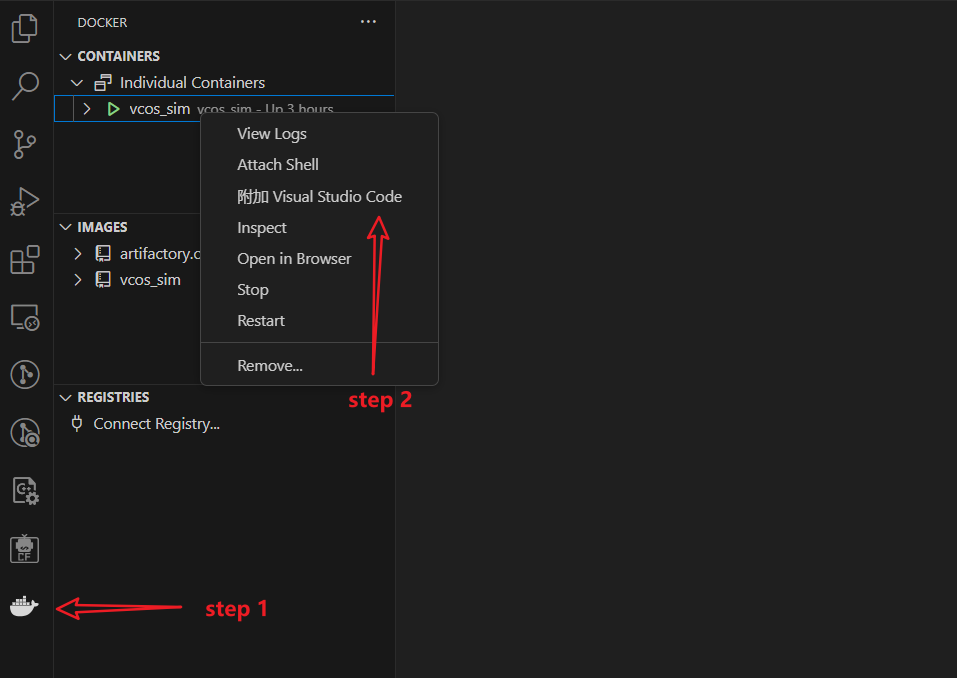

# 部署运行流程
## 1. 在开发板上运行
### 1.1. SemiDrive E3650_DEV_KIT开发板烧录运行
- 开发板：
  HaloOS提供的rt_demo工程支持在SemiDrive E3650_DEV_KIT开发板硬件上运行，如果开发者需要基于该开发板运行调试，请自行采购[E3650_DEV_KIT开发板链接]()
- 程序烧录工具：
  E3650程序烧录支持多种工具，本文档仅描述SemiDrive官方提供的[xxxx工具]()

- 程序烧录：

### 1.2. Infineon A2G_TC397_5V_TFT开发板烧录运行
- 开发板：
  HaloOS提供的rt_demo工程支持在infineon KIT_A2G_TC397_5V_TFT开发板硬件上运行，如果开发者需要基于该开发板运行调试，请自行采购[TC397开发板链接](https://www.infineon.com/cms/en/product/evaluation-boards/kit_a2g_tc397_5v_tft/)
- 程序烧录工具：
  TC397程序烧录支持多种工具，本文档仅描述infineon官方提供的[Aurix Flasher工具](https://softwaretools.infineon.com/tools/com.ifx.tb.tool.aurixflashersoftwaretool)
  Aurix Flasher工具支持通过串口或DAP/JTAG下载程序，详细的烧录方式说明请参考开发板的User Manual，请在TC397开发板链接页面下载
  如果通过DAP或JTAG接口下载程序，需要采购infineon提供的[miniwiggler工具](https://www.infineon.com/cms/en/product/evaluation-boards/kit_dap_miniwiggler_usb/)
- 程序烧录：
  Aurix Flasher工具使用请参考工具的帮助文档
  在Aurix Flasher工具中加载output目录下编译生成的elf文件，并执行program；烧录完成以后需断开连接并下电，再上电以后可正常运行，在串口中断连接串口可查看日志及进行shell命令交互

## 2. 在模拟器上运行（无需硬件）
### 2.1. 快速运行
VCOS SIM（模拟器）提供了一种无需目标硬件平台，可直接在Ubuntu环境上运行配置好的docker镜像进行仿真调试。目前使用模拟器可以测试VCOS的许多特性，包括调度表，中断，以太通信等
#### 2.1.1. 环境准备
##### 2.1.1.1. 安装linux-gnu-gcc编译器
> 注意：VCOS SIM 强依赖linux-gnu-gcc编译器，Ubuntu下通常有自带的linux-gnu-gcc，如果没有安装，需要执行以下命令安装

```bash
sudo apt update
sudo apt install gcc
```
可以通过`gcc --version`验证安装，如果输出版本号表示安装成功

##### 2.1.1.2. docker环境部署
下载[vcos_sim docker镜像](https://gitee.com/yanxiaoyong_1/sim-docker)，解压`vcos_sim.tar.7z.001`得到`vcos_sim.tar`
1. 导入docker镜像的tar包
   ```bash
   docker load -i vcos_sim.tar
   ```
2. 启动vcos_sim docker容器，docker与Ubuntu系统共享目录，方便直接调试
   ```bash
   docker run -it --cap-add=NET_ADMIN --device=/dev/net/tun --name vcos_sim -v /home:/home vcos_sim /bin/bash &
   ```
3. 检查容器是否成功启动
   ```bash
   docker ps -a
   ```
   执行以上命令，可以在进程中看到vcos_sim

4. 进入vcos_sim镜像
   ```bash
   docker exec -it vcos_sim /bin/bash
   ```
5. vcos_sim镜像成功启动以后，可以在Linux系统的vscode中安装Docker、Dev Containers插件  
6. 在vscode中通过安装的插件连接vcos_sim容器，即可在vscode中进行调试  

7. 在vscode中打开holoosspace文件夹

#### 2.1.2. 在linux系统中执行编译
在[工程编译](./02_compiling.md)章节，已经详细介绍了如何完成编译，支持在开发板上运行。这里将rt_demo运行在我们的虚拟仿真环境上，需要切换到`haloosspace/vcos/build`目录，执行以下命令编译支持模拟器运行的镜像：
```bash
python3 vcos_build.py -app_name rt_demo -board_name E3650_DEV_KIT -compiler gcc -maketool ninja -sim 1 -all
```

#### 2.1.3. 运行
##### 2.1.3.1. 在vcos_sim docker环境中直接运行
```bash
cd ./output/rt_demo_E3650_DEV_KIT_gcc
./rt_demo
```

##### 2.1.3.2. 在vscode中通过GDB调试
1. 安装插件 c/c++ 插件
2. 配置launch.json，下文提供了一段可用的launch.json供参考
    ```json
    {
        "version": "0.2.0",
        "configurations": [
            {
                "name": "(gdb) 启动",
                "type": "cppdbg",
                "request": "launch",
                "program": "${workspaceFolder}/output/rt_demo_E3650_DEV_KIT_gcc/rt_demo",
                "args": [],
                "stopAtEntry": false,
                "cwd": "${workspaceFolder}",
                "environment": [],
                "externalConsole": false,
                "MIMode": "gdb",
                "setupCommands": [
                    {
                        "description": "为 gdb 启用整齐打印",
                        "text": "-enable-pretty-printing",
                        "ignoreFailures": true
                    },
                    {
                        "description": "Ignore SIGUSR1",
                        "text": "handle SIGUSR1 nostop noprint pass",
                        "ignoreFailures": true
                    }
                ]
            },
        ]
    }
    ```
3. 在vscode中可以直接通过GDB调试运行
