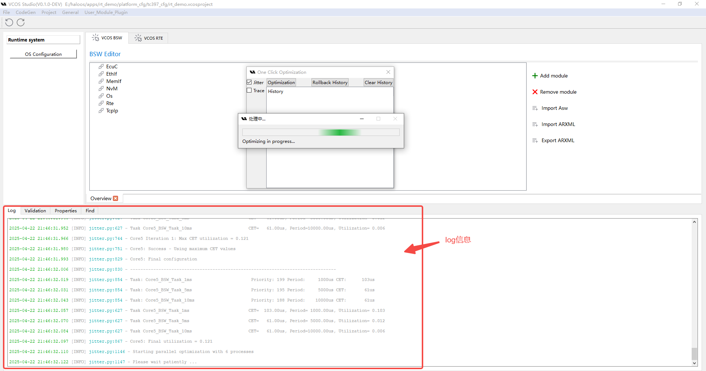
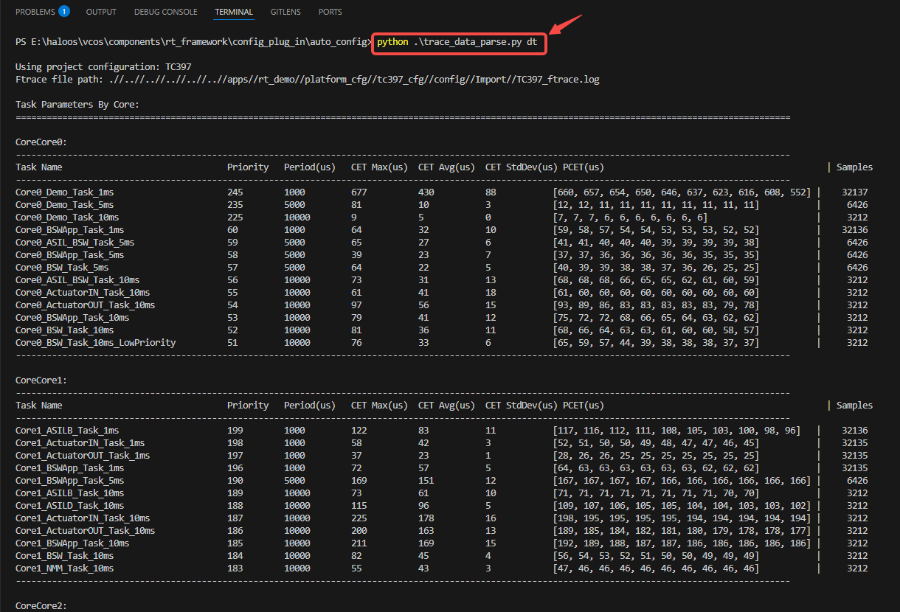

# 关键周期任务确定性方案实践
## 1. 应用场景

为了给乘客提供极致平稳舒适的行车体验，理想汽车开发了[魔毯空气悬架](https://www.lixiang.com/tech/suspension#li),该系统可根据不同的驾驶条件和路面情况，实时调节空气弹簧的刚度与减震器的阻尼特性，从而消除路面不平带来的振动和颠簸，并具备毫秒级的响应能力。魔毯空气悬架的控制对操作系统实时性要求极高，其处理算法为1ms周期任务，要求任务周期抖动控制在100μs以内，以实现更精准的控制和更平稳的悬架响应。

在包含空气悬架功能的域控制器中，可能运行100+个任务，提升系统实时性需解决以下问题：
- 任务周期抖动高：任务随机部署可能引入抖动，需优化调度策略。
- 人工优化效率低：任务数量多且相互干扰，单一任务抖动的优化可能引发其他任务抖动升高，需全局协调。人工优化需多次迭代，效率低下。

## 2. 演示目标
+ **任务抖动性能对比**
    - 未进行任务编排：1ms周期任务（悬架算法关键任务）抖动300μs，超出指标要求。
    - 编排优化后：基于VCOS实时调度技术，关键任务抖动降至100μs以内，满足指标。非关键任务抖动指标无劣化。
+ **优化效率对比**
    - 传统人工优化流程：单次迭代：时序分析（30分钟）、任务偏移调整（10分钟）、编译烧录验证（20分钟）。因多任务相互影响，需多次调整（平均10次），总耗时约600分钟（约1天工作量）。
    - VCOS配置工具优化：基于调度仿真模型，通过算法自动寻优（迭代10000次），5分钟即可生成较优解。

## 3. 技术方案


通过以下关键技术实现实时性目标:
- **实时调度技术**
  - **RM调度策略**：基于Rate-Monotonic调度策略分析系统可调度性，避免因不可调度导致的周期抖动。
  - **高精度时钟**：采用高精度时钟，提供ns级精准调度，可以更精细地分配调度点，减少任务抢占引起的抖动。
  - **调度表机制**：将悬架相关任务部署在一个调度表中，确保严格时序执行，降低不确定性抖动。
- **实时性配套工具**
  - **时序分析工具**：通过FTRACE采集全系统任务数据（执行时间CET、响应时间RT、抖动JIT等），基于实测结果合理分配时间预算。
  - **全局配置工具**：配置任务、中断、运行核心、截止时间约束、端到端的延时等系统参数；基于UI或XML输入，自动生成C代码，提升开发效率、降低编码出错概率；支持输出部署全景图到寻优算法；支持寻优算法输出结果自动写回。
  - **全局寻优算法**：基于全局配置工具获取系统部署全景图信息，再通过时序分析工具获取任务执行时间，采用启发式算法，以抖动约束、可调度性约束、端到端事件链约束为目标，全局寻优，找到配置最优解。
  - **调度仿真模型**：全局寻优算法需要数万次的迭代搜索最优配置，基于硬件开发板验证，每次参数迭代需要几分钟，万次迭代需要几天时间。为提升寻优效率，采用仿真模型，模拟调度行为，无需烧录，在PC端构建调度仿真模型，模拟配置变更对时序的影响，无需烧录即可在5分钟内完成万次迭代寻优。

## 4. 案例实操

### 4.1. 测试环境
硬件环境：
|开发板名称                    |开发板简介               |购买链接|
|:----------------------------|:----------------------:|:----------------------:|
| 英飞凌TC397Demo板    |英飞凌的TriCore评估板是一款强大的开发和测试平台，搭载着TC3X7系列的AURIX™ 2G控制器（TC397, TC387），封装在LFBGA-292中。这款评估板专为快速原型开发和功能验证而设计，是工程师们开发创新应用的理想选择。 |https://www.infineon.com/cms/en/product/evaluation-boards/kit_a2g_tc397xa_3v3_tft/ |
| 芯驰E3650 Demo板    |(4+4) x R52+, 600MHz Low Power Core, HSM core 5MB SRAM, 16MB + 512KB eNVM BGA495 |https://support.semidrive.com/product/detail/22|

软件配置：
参考快速开始章节进行环境安装。[编译](../quick_start/02_compiling.md)，[运行](../quick_start/03_running.md)

### 4.2. 操作流程
整个操作过程的流程图如下：


#### 4.2.1. rt_demo工程的编译、烧录、运行
- windows环境下直接双击vcos_studio/configurator/configurator.bat打开UI界面；
- Linux环境下运行./vcos_studio/configurator/configurator.sh打开UI界面；
- 加载Demo工程的配置文件，位于/examples/rt_demo/platform_cfg/tc397_cfg.vcosproject
生成代码、[编译](../quick_start/02_compiling.md)、[运行](../quick_start/03_running.md)的步骤请参考“快速开始”章节


#### 4.2.2. 用Trace测试性能数据
抖动优化功能依赖于性能测试数据，需要利用Trace模块进行性能数据采集，Trace的详细配置操作步骤请参考实时性分析工具用户手册，这里简单描述一下ftrace格式的log文件获取的操作：
- 开始采集，在/vcos_studio/halo_trace目录下执行命令：
```python
python ./trace_processor.py -m online -device ./device_conf.json -log ./logs
```
- 停止采集：上位机与VCOS通讯建立后会持续采集报文，若用户想停止采集数据，可以输入"exit" 加回车来结束数据接收。
- 输出结果：<device_name>_data.bin 即 trace 二进制数据文件，是设备发送的原始 trace 报文。

 

- bin文件转ftrace文件:
```python
python .\trace_processor.py -m bin_to_ftrace -data logs\11_27_180103 (11_27_180103这个数字是生成的log文件，以时间戳命名)
```
最终生成Ftrace格式的文件TC397_ftrace.log，将此文件放到/examples/rt_demo/platform_cfg/tc397_cfg/config/Import路径下：


#### 4.2.3. 触发抖动优化并等待执行结束
在VCOS UI界面上点击 "Jitter Auto Optimization" 按钮触发一键抖动优化功能，这时会触发components\rt_framework\plug_in\auto_config\jitter.py脚本开始执行：


**log信息查看**
运行时主进程中数据预处理及出错信息会输出到UI界面下方的Log窗口，如下图：

并行计算多进程的遗传算法及仿真时的数据及出错信息位于/examples/rt_demo/platform_cfg/tc397_cfg/config/Export路径下：


#### 4.2.4. 优化结果自动写回
抖动优化功能的实现是根据实际的性能测试数据，利用遗传算法自动寻找最优的任务激活时间偏移量，通过调度仿真模拟程序动态的构建任务的实际执行情况，经过多次循环迭代，最终找到任务激活时间偏移量的最优解，使多个任务激活时间离散化，避免了某个时刻需要处理的任务数多，某个时刻需要处理的任务数少，由此而产生的任务周期抖动。工具自动将这些时间偏移量数据回填到配置中。


最后，生成代码，编译后烧录到板子中运行（详细步骤请参考“快速开始”章节），重新利用trace模块采集性能数据，生成ftrace文件，通过components\rt_framework\plug_in\auto_config\trace_data_parse.py解析脚本解析出TC397_ftrace.log数据，查看抖动优化的效果。


在components\rt_framework\plug_in\auto_config路径下执行命令：python .\trace_data_parse.py dt，解析ftrace文件，同时会绘制出每个Task所有采样点的图，位于/examples/rt_demo/platform_cfg/tc397_cfg/config/Export路径下：



### 4.3. 优化效果
原始状态下，不做任务编排优化（如下表格中的左侧视图），周期为1ms、5ms、10ms的任务都有明显的抖动，任务周期不稳定。基于VCOS实时调度技术，配合时序分析工具对周期任务做优化（如下表格中的右侧视图），1ms任务周期趋于稳定，确定性明显增强。

|**Task Name**                    |**优化前任务周期采样点分布图** |**优化后任务周期采样点分布图**|
|:----------------------------|:----------------------:|:----------------------:|
| Core0_BSWApp_Task_1ms       |      |          |
| Core0_BSW_Task_5ms          |         |          |
| Core0_BSW_Task_10ms         |        |          |
| Core1_BSWApp_Task_1ms       |      |          |
| Core1_ActuatorIN_Task_1ms   |  |      |
| Core1_ActuatorOUT_Task_1ms  | |  |
| Core1_BSWApp_Task_5ms       |      |          |
| Core1_BSWApp_Task_10ms      |     |          |
