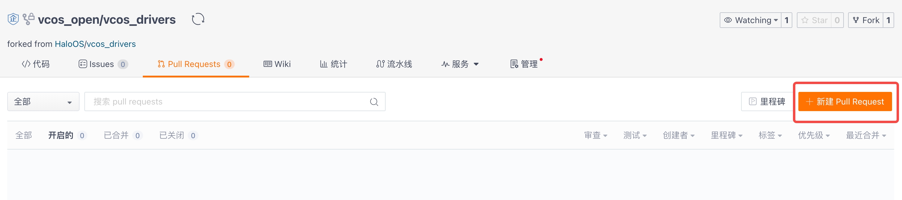
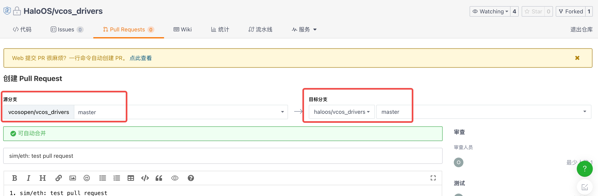

# Contribution process
You are very welcome to join the **HaloOS** open source community and make your own contribution to the continuous improvement of this project.
This open source project follows the Apache License 2.0 license agreement.

## 1. Sign a Contributor License Agreement
In order to avoid conflicts in open source license agreements or infringe on other people's intellectual property rights, you need to sign a Contributor License Agreement (CLA) before contributing code and documents to ensure the code or documents you contribute.
The third-party code that is original by itself or referenced does not conflict with the Apache License 2.0 protocol.

CLA signing page: [Gitee CLA (Open Source Contributor Agreement) signing page](https://gitee.com/organizations/haloos/cla/halooscla)

Check the CLA signing status: [Gitee My signed CLA (Open Source Contributor Agreement) page](https://gitee.com/profile/clas)

## 2. Environmental preparation
In order to successfully participate in project contribution, you need to prepare the necessary contribution tools in advance
1. git, this project uses git to manage code and document changes. If your computer does not have a pre-installed git tool, please download the corresponding git tool according to your computer system, https://gitee.com/help/categories/43.
2. Set up the ssh public key. You can use the https protocol and the ssh protocol to download the project code. Since you need to enter a password every time you download the https protocol, it is quite cumbersome.It is recommended to use the ssh protocol to download the repository code. You need to set the ssh public key in advance.
For specific settings, please refer to https://gitee.com/help/categories/38.

## 3. Overall process
The overall process of contribution is previewed as shown in the figure below


## 4. Find a warehouse
Since this project adopts a multi-warehouse management method, please first look for the warehouses and branches you are planning to participate in the contribution (default is the master branch) in the project's homepage.

The following is a case where `vcos_drivers` warehouse is used as an example to illustrate the contribution process

## 5. Fork Repository and Download
1. Click the Fork button in the upper right corner of the warehouse page of this project and Fork to your account, as shown in the figure


2. After Fork to your account, download the warehouse under your account and make modifications and submissions.


## 6. Modify and submit to your own account to the warehouse
Modify the code in your own code repository and make a submission
```bash
git add . # Add your own modified file
git commit -s # Confirm your own modification and submit, and add Signed-off-by. Note that the email address must be the same as the email address that signed the CLA
git push origin master # Push to the repository under your account, master branch (can be modified as needed)
```
## 7. Request a merged code or document
### 7.1. Create a Pull Request
On the Pull Request page of your warehouse, click the `New Pull Request` button.



Fill in the repository and branch under your account, and select HaloOS open source repository and branch in the target branch.

### 7.2. Fill in the Pull Request information
On the Pull Request page of gitee, after selecting the source branch and the target branch, gitee will automatically detect your modifications.
Click `Submit Record` or `File Change` to confirm the modification, and fill in the complete Pull Request description according to the template.
Good Pull Request description that helps Pull Request quickly review and merge.


After confirming that, click the `Create Pull Request` button to finally create Pull Request

### 7.3. Confirm Pull Request and Participate in Discussion
After creating a Pull Request, you can find the Pull Request you created in the target repository and branch


Click on your Pull Request to see the community's comments and specific status.You can add your own comment or reply to someone else’s comments.


When the Pull Request passes all checks and reviews, if accepted by the community, it will be merged into the target repository and branch.


At this point, a complete code or document contribution has been completed. Thank you very much for your contribution to our open source project!

### 7.4. Lightweight Pull Request
If it is just the simplest modification to the document or code, you can initiate a lightweight Pull Request in the gitee page to complete the contribution.
**Please make sure your modifications pass the test**

On the gitee browsing page of the code or document, click the `Edit` button in the upper right corner to enter the online editing page.


After editing, add `Complete Information` and `Extended Information`.In order for the reviewer to understand your Pull Request well, please provide as detailed information as possible, including why, how, and the tests passed.


Finally, click the `Submit Review` button to initiate a Pull Request, the result is as shown in the figure


## 8. Submit defects and request new features
### 8.1. Submit defects
If you find that the project has non-security-related defects, you can create a new Issue on the `Issues` page of the gitee-related repository, select the `Defect` type, and describe the environment where the defect occurs in detail according to the template, reproduction steps, and error information.
You are also welcome to directly modify the defects and submit a Pull Request according to the above guidelines.


### 8.2. Request new features
If you have good feature suggestions for your project, you can create a new Issue on the `Issues` page of the gitee-related repository, select the Requirements type, and describe in detail what features are solved according to the template.
You are also welcome to implement new features and submit a Pull Request according to the above guidelines.


## 9. Security vulnerabilities
If you find a security vulnerability, please **Don't mention public Issue, please click [Ideal Security Emergency Response Center] (https://security.lixiang.com/index) to report the security vulnerability.

## 10. Thanks
Thank you for your contribution to this open source project!
If you are interested in this project and want to follow the progress, you can click the `Watching` button in the upper right corner of the warehouse page.


If you like this project, you can click the `Star` button in the upper right corner of the corresponding repository page.
