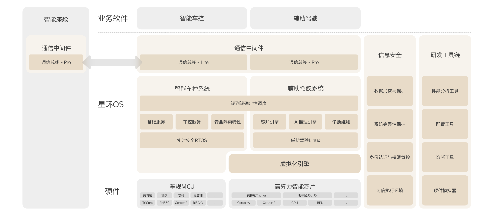
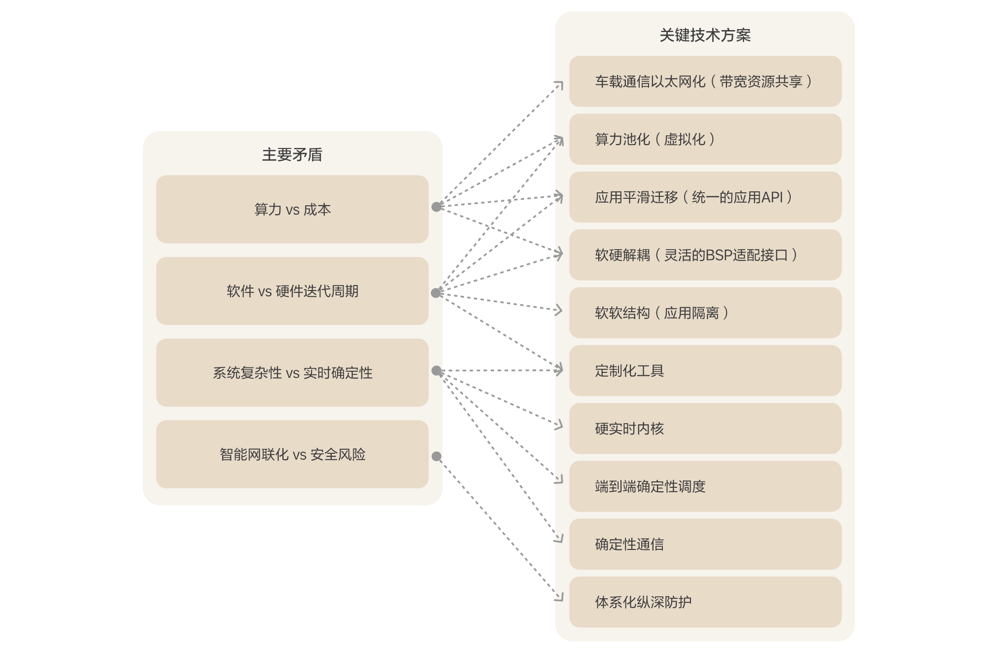
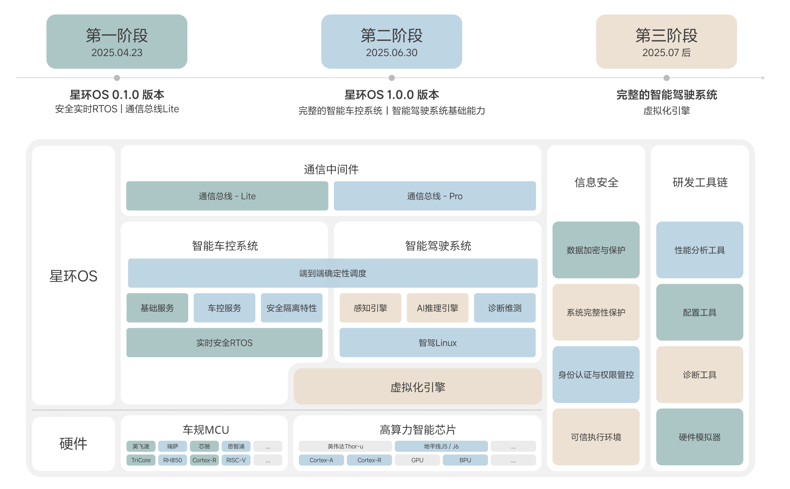

# Introduction to the LiAuto HaloOS Open Source Project

## 1. Overview
**LiAuto HaloOS** is a vehicle-level operating system independently developed by Li Auto to address the increasing system complexity, functional diversity, and high-performance demands of modern intelligent vehicles. Its core goal is to provide a unified, efficient, and reliable technical foundation platform for computing, communication, and control functions across the entire vehicle. By adopting an open-source model combined with its own R&D practices, LiAuto HaloOS aims to overcome the bottlenecks of traditional closed in-vehicle systems in terms of flexibility, scalability, and collaborative efficiency, supporting the continuous development and evolution of intelligent vehicle functions.

From a technical architecture perspective, LiAuto HaloOS is designed based on a "global collaborative computing model" to achieve system-level deep optimization. Its key cross-domain scheduling capabilities significantly enhance the processing efficiency and operational stability of the vehicle's core "perception-decision-execution" chain. Test data shows a 2x improvement in response efficiency and a 5x increase in stability. This optimization brings quantifiable performance improvements in specific application scenarios: for example, at a high speed of 120 km/h, the system can effectively reduce the braking distance of AEB (Automatic Emergency Braking) by 7 meters. Additionally, through precise cross-domain collaborative control, the response rate of the suspension system and the accuracy of vehicle posture control are improved by 73%. In terms of safety, the system adopts an integrated software-hardware deep defense architecture, incorporating high-performance cryptographic algorithm implementations (with specific algorithm performance reaching 4-8 times that of mainstream solutions) and end-to-end secure communication and access control mechanisms. This aims to build a trusted in-vehicle computing environment to effectively address the complex security challenges brought by intelligence and connectivity.

In terms of engineering efficiency and hardware adaptability, LiAuto HaloOS focuses on solving resource utilization and development efficiency issues through its self-developed virtualization framework and heterogeneous computing resource sharing technology. Test results show that this technology effectively reduces AI computing-related virtualization overhead by 80% and shortens device access latency in virtualized environments by 90%. At the same time, the system design emphasizes hardware platform portability, supporting rapid adaptation to various mainstream and emerging automotive-grade chips, including those from SemiDrive, Infineon, NVIDIA, and Horizon Robotics. This reduces the adaptation and verification cycle for new chip platforms from the industry standard of 3-6 months to just 4 weeks. This technical system directly helps reduce the development cost of vehicle software, minimizes dependency on specific hardware, and supports automakers in more efficiently iterating and deploying intelligent functions.

The core motivation for LiAuto HaloOS to choose open source is to promote technical collaboration within the automotive industry and jointly address the widespread issue of redundant investment in foundational software ("reinventing the wheel"). By opening up core technologies, it aims to work with industry partners (including other automakers, chip suppliers, software developers, etc.) to build and improve in-vehicle operating system technologies, achieve shared and collaborative development of technological achievements, and ultimately apply more advanced and reliable technologies to mass-produced vehicles faster, benefiting a wide range of users.

## 2. Technical Architecture

LiAuto HaloOS is a vehicle operating system designed to meet AI and intelligent business needs. Its core design focuses on achieving global collaboration and software-hardware integration, emphasizing competitive solutions in terms of performance, security, cost, and efficiency, while supporting the evolution of more complex system functions in the future. Its architectural design focuses on the following aspects:
- Centralized and shared resources: Compute pooling, Ethernet-based communication, global scheduling, and service sharing.
- Extreme performance: End-to-end real-time, determinism, and reliability in critical paths of hybrid systems.
- Rapid iteration: Decoupling of hardware and software, decoupling of software components, service-oriented design, and customized tools.
- High security: Native security with systematic deep defense to protect private data and vehicle control commands.



LiAuto HaloOS consists of the following four main components, which work together like different systems in the human body, comparable to the brain, cerebellum, nervous system, and immune system, to support vehicle functions:

### 2.1. Advanced Driver Assistance System (ADAS)

This component can be compared to the "brain" of the vehicle's control system, responsible for handling complex, computation-intensive tasks to ensure the ADAS functions operate quickly and effectively. The design focuses on improving computational efficiency and resource utilization:

- Optimizing AI-related algorithms' runtime speed and stability through task scheduling and image processing enhancements.
- Leveraging virtualization technology to enable compute resource sharing, allowing a single chip to safely handle multiple tasks concurrently, thereby improving hardware resource utilization.

### 2.2. Intelligent Vehicle Control System

This component is akin to the "cerebellum" of the vehicle, focusing on the rapid and precise

### 3. Key Technologies

In the development process of intelligent connected vehicle software platforms, four core contradictions and engineering challenges are commonly faced:
- The resource optimization dilemma between limited computing power and strict cost constraints.
- The collaborative adaptation challenge between rapidly iterating software ecosystems and long-cycle hardware development.
- The technical balance issue between increasing system complexity and sub-millisecond real-time determinism requirements.
- The systematic contradiction between intelligent and connected evolution and dual risk prevention for information security and functional safety.

Against this backdrop, LiAuto HaloOS has built the following key technical solutions (as shown in the figure below) to address these challenges through systematic design and technological integration, achieving conflict resolution:



### 3.1. Contradiction 1: Computing Power vs Cost

**Description**: The contradiction between growing AI computing power demands and controllable costs.

**Solution**: Building vehicle-level resource sharing and collaboration capabilities with the operating system at the core.

- **Compute Pooling (Virtualization)**: Virtualization technology abstracts heterogeneous computing resources (CPU, NPU, IO devices, etc.) into a unified "compute pool." Through a global resource view and intelligent scheduling algorithms, computing resources are dynamically allocated and reclaimed, enabling cross-domain and cross-application sharing.
- **Ethernet-Based In-Vehicle Communication (Bandwidth Resource Sharing)**: Deeply integrates and optimizes the in-vehicle Ethernet protocol stack to achieve low-latency, high-bandwidth data exchange and service invocation between different domain controllers or computing units.
- **Seamless Application Migration (Unified Application API)**: Provides standardized API interfaces (e.g., POSIX) to reduce application software dependency on specific hardware, facilitating deployment and migration of applications across different computing nodes.

### 3.2. Contradiction 2: Software vs Hardware Iteration Cycles

**Description**: The contradiction between rapid software iteration and hardware development cycles.

**Solution**: A deeply decoupled, flexible, and adaptable software architecture.

- **Hardware-Software Decoupling (Flexible BSP Adaptation Interface)**: Supports and is compatible with multiple types of hardware-software interfaces (MCAL, HAL), enabling rapid chip adaptation.
- **Software-Software Decoupling (Application Isolation)**: Implements isolation of different business software on MCUs, modularizing and service-orienting vehicle control applications to allow independent iteration and upgrades.
- **Customized Tools**: Continuously improving toolchains and simulation environments to simplify development dependencies and enhance efficiency.

### 3.3. Contradiction 3: Complex Systems vs Real-Time/Stability

**Description**: The contradiction between system complexity and real-time determinism requirements.

**Solution**: Cross-domain collaboration to build end-to-end real-time deterministic solutions.

- **Hard Real-Time Kernel**: Adopts preemptive, priority-driven hard real-time scheduling strategies to achieve extremely low, predictable interrupt latency and task switching overhead.
- **End-to-End Deterministic Scheduling**: Manages critical task chains across multi-core heterogeneous processors and even different physical nodes from a global perspective. Through global synchronization and collaborative scheduling technologies, it orchestrates computing tasks and data flows to ensure timing constraints.
- **Deterministic Communication**: Deeply optimizes the in-vehicle Ethernet communication stack to reduce inter-process/virtual machine/chip communication latency, providing guaranteed bandwidth, bounded latency, and extremely low jitter for critical data flows.
- **Integrated Tools**: Provides self-developed tools for end-to-end timing analysis and verification, capable of automatically generating optimal scheduling and communication configurations.

### 3.4. Contradiction 4: Intelligent Connectivity vs Security Risks

**Description**: The contradiction between intelligent connectivity and security risk mitigation.

**Solution**: Building native, systematic deep defense through software-hardware collaboration.

- **Data Encryption and Protection**: Uses strong encryption algorithms and secure key management mechanisms to ensure the confidentiality and integrity of sensitive data during storage and transmission.
- **System Integrity Protection**: Establishes a chain-of-trust-based step-by-step verification mechanism during boot. Continuously monitors critical system files during runtime to prevent malicious modifications.
- **Identity Authentication and Access Control**: Performs fine-grained identity authentication and access control for entities accessing system resources, ensuring only legitimate entities can access and operate resources.
- **Trusted Execution Environment (TEE)**: Utilizes hardware isolation technologies (e.g., ARM TrustZone) to create isolated TEE OS environments for executing the most sensitive operations, protecting core assets.

## 4. Open Source Plan

LiAuto HaloOS will gradually open its source code starting from the end of April 2025:



## 5. Quick Start

| Step | Documentation |
|------|---------------|
| Step 1: Download | [Source Code Download Guide](quick_start/01_downloading.md) |
| Step 2: Compile  | [Project Compilation Guide](quick_start/02_compiling.md) |
| Step 3: Run      | [Deployment and Execution Guide](quick_start/03_running.md) |


## 6. Code Directory Structure

```
haloosspace
├── .repo                  # Repo manifest repository, configuring multi-repository sync rules (based on Repo tool)
├── apps                   # Collection of example applications
│   ├── rt_demo            # Example project for real-time critical periodic tasks
│   ├── vbslite_demo       # Example project for lightweight in-vehicle communication bus
│   └── (...)              # (Not yet open-sourced) Other advanced application demos
├── build                  # Build system configuration (build scripts, CMake/Makefile rules)
├── docs                   # Comprehensive documentation for the HaloOS project
│   ├── ...                # Quick start, contribution guidelines, etc.
│   └── README.md          # General introduction to the HaloOS project
├── tools                  # Development toolchain
│   ├── halo_trace         # System-level performance tracing tool (records task/interrupt timing)
│   └── (...)              # (Not yet open-sourced) Other HaloOS supporting tools
├── vbs                    # Communication middleware
│   ├── docs               # Developer documentation for communication middleware
│   ├── (vbspro)           # (Not yet open-sourced) vbspro implementation
│   └── vbslite            # vbslite implementation
├── vcos                   # Intelligent vehicle control system
│   ├── apps               # Built-in system applications
│   ├── build              # System build configuration, build scripts, etc.
│   ├── components         # Core functional components (e.g., communication stack, storage stack implementation)
│   ├── docs               # Developer manual for the intelligent vehicle control system
│   ├── drivers            # Hardware drivers (e.g., I/O, CAN, Ethernet)
│   ├── examples           # Key system examples
│   ├── external           # Third-party open-source software
│   ├── include            # Global header files (POSIX/function stack interface definitions, currently empty)
│   ├── kernel             # Kernel source code
│   ├── tests              # Test framework and test cases
│   ├── vcos_studio        # VCOS supporting tools for configuration, maintenance, etc.
│   └── vendor             # Third-party adaptation code
└── (...)                  # (Not yet open-sourced) Other subsystems (e.g., ADAS OS, virtualization engine, etc.)
```

## 7. Subsystem Documentation

| Subsystem Type         | Subsystem Introduction                                      | Developer Documentation Collection |
|-------------------------|------------------------------------------------------------|-------------------------------------|
| Intelligent Vehicle Control System | [Introduction to the Intelligent Vehicle Control OS Subsystem](https://gitee.com/haloos/vcos/blob/master/OVERVIEW.md) | [Developer Documentation Index for the Intelligent Vehicle Control OS Subsystem](https://gitee.com/haloos/vcos/blob/master/README.md) |
| Communication Middleware | [Introduction to the Communication Bus Subsystem](https://gitee.com/haloos/vbs/blob/master/OVERVIEW.md) | [Developer Documentation Index for the Communication Bus Subsystem](https://gitee.com/haloos/vbs/blob/master/README.md) |
| (To be open-sourced)   | ...                                                        | ...                                 |

> Developer documentation for subsequent open-source content will be released alongside the code.

## 8. Key Technical Practices

| Subsystem               | Key Technical Practices                                    |
|-------------------------|------------------------------------------------------------|
| Intelligent Vehicle Control OS | [Practice of Deterministic Solutions for Critical Periodic Tasks](tech_cases/key_periodic_task_real_time_practice.md) |
| Communication Bus       | [Innovative Practice of Lightweight In-Vehicle Communication Bus](tech_cases/vehicle_communication_bus_lightweight_practice.md) |
| (To be open-sourced)    | ...                                                        | ...                                 |

> Key technical practice documentation for subsequent open-source content will be released alongside the code.

## 9. Supported Development Platforms

HaloOS has been adapted to various development platforms. Based on the currently open-sourced functionality, the table below introduces several verified typical development boards/environments:

| Supported Subsystems    | Development Board/Environment                              | Chip Model       | Main Features                                                                 | Typical Application Scenarios                          | Reference Purchase Link                                |
|-------------------------|------------------------------------------------------------|------------------|------------------------------------------------------------------------------|-------------------------------------------------------|-------------------------------------------------------|
| Intelligent Vehicle Control OS, Communication Bus | SemiDrive E3650 Dev Kit Development Board Suite | E3650            | Integrated with 4 32-bit ARM Cortex R52 + lockstep cores; supports multi-core parallel processing; equipped with UART-to-serial chip for interaction with host PC; supports ADC, SENT, CAN-FD, LIN, and two Gigabit Ethernet ports; includes buttons for quick validation of low-power mode; reserved Flash and eMMC pads for external storage expansion | Regional control applications, electric drive control applications, chassis control applications, ADAS control applications | [Official Link](https://www.semidrive.com/product/E3650) |
| Intelligent Vehicle Control OS, Communication Bus | Infineon KIT_A2G_TC397XA_3V3_TFT Development Board | TC397            | Integrated with 6 high-performance 32-bit CPU cores (TC1.6.2P); supports multi-core parallel processing; equipped with 4 LEDs and a buzzer for display interaction; supports CAN-FD, LIN, Gigabit Ethernet, and USB/UART bridge communication; built-in SD card slot for storage expansion | Regional control applications, electric drive control applications, chassis control applications, ADAS control applications | [Official Link](https://www.infineon.com/cms/en/product/evaluation-boards/kit_a2g_tc397xa_3v3_tft/) |
| Intelligent Vehicle Control OS, Communication Bus | Intelligent Vehicle Control OS SIM Simulator     | -                | Provides a virtualization runtime environment based on Linux/WSL without hardware support; supports interrupt signal simulation, Ethernet communication (including VLAN), and virtual bridge configuration; integrates virtual Ethernet driver (vEth) to implement TCP/IP stack; supports GDB debugging tools | Software testing, development debugging, algorithm validation | No purchase required, included in the project (usage instructions can be found in [Deployment and Execution Guide](quick_start/03_running.md)) |

## 10. License Agreement

LiAuto HaloOS primarily follows the [Apache License V2.0](https://www.apache.org/licenses/LICENSE-2.0.txt). For details, please refer to the LICENSE statement in each code repository.

For third-party open-source software and license information, refer to [Third-Party Open Source Software Notice](notices/third_party_open_source_software_notice.md).

## 11. Contact Information

Email: [HaloOS@lixiang.com](mailto:HaloOS@lixiang.com)

Website: [https://www.lixiang.com/tech/haloos](https://www.lixiang.com/tech/haloos)

## 12. Contribution

[Contribution Guidelines](CONTRIBUTING.md)

## 13. Disclaimer

[Disclaimer](DISCLAIMER.md)
