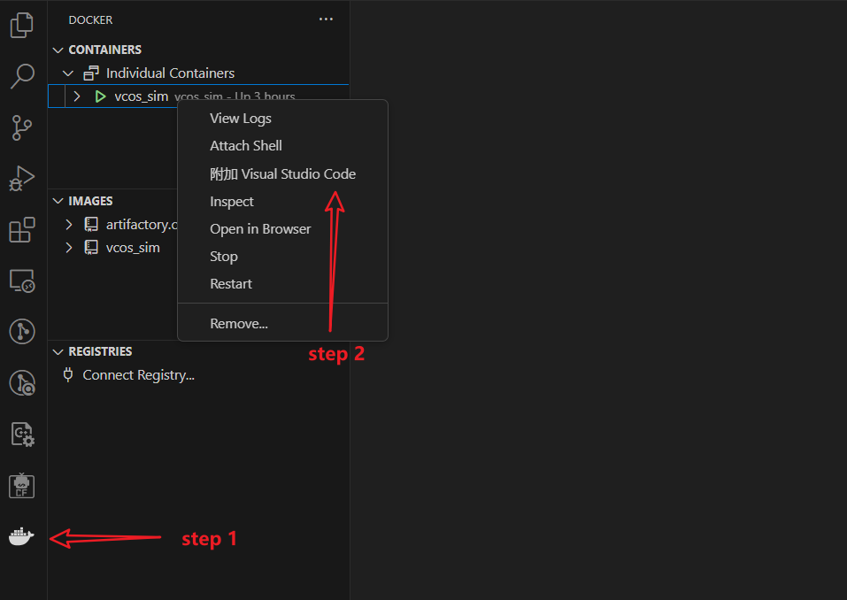

# Deployment operation process
## 1. Run on the development board
### 1.1. SemiDrive E3650_DEV_KIT development board burn-in operation
- Development Board:
The rt_demo project provided by HaloOS supports running on the SemiDrive E3650_DEV_KIT development board hardware. If developers need to run and debug based on the development board, please purchase [E3650_DEV_KIT development board](https://support.semidrive.com/product/detail/22)
- Program burning tool:
E3650 supports a variety of burning tools (such as Jlink, Trace32, etc.), and developers need to choose and bring their own tools according to actual needs.
- Program burn:
For program burning methods, please refer to [SemiDrive E3650_DEV_KIT Development Board burning method](https://gitee.com/haloos/vcos_vendor_semidrive/blob/master/docs/SemiDrive%20E3650_DEV_KIT%20%E5%BC%80%E5%8F%91%E6%9D%BF%E7%83%A7%E5%BD%95%E6%96%B9%E6%B3%95.md)
Please refer to [SemiDrive E3650_DEV_KIT Development Board Debugging Method] (https://gitee.com/haloos/vcos_vendor_semidrive/blob/master/docs/SemiDrive%20E3650_DEV_KIT%20%E5%BC%80%E5%8F%91%E6%9D%BF%E8%B0%83%E8%AF%95%E6%96%B9%E6%B3%95.md)

### 1.2. Infineon A2G_TC397_5V_TFT development board burn-in operation
- Development Board:
The rt_demo project provided by HaloOS supports running on the Infineon KIT_A2G_TC397_5V_TFT development board hardware. If developers need to run debugging based on the development board, please purchase [TC397 development board link] yourself (https://www.infineon.com/cms/en/product/evaluation-boards/kit_a2g_tc397_5v_tft/)
- Program burning tool:
TC397 program burning supports a variety of tools. This document only describes the [Aurix Flasher Tool] officially provided by Infineon (https://softwaretools.infineon.com/tools/com.ifx.tb.tool.aurixflashersoftwaretool)
The Aurix Flasher tool supports downloading programs through serial port or DAP/JTAG. For detailed descriptions of burning methods, please refer to the User Manual of the development board. Please download it on the TC397 development board link page.
If you download the program through the DAP or JTAG interface, you need to purchase the [miniwiggler tool] provided by Infineon (https://www.infineon.com/cms/en/product/evaluation-boards/kit_dap_miniwiggler_usb/)
- Program burn:
Please refer to the help documentation for Aurix Flasher tool
Load the generated elf file in the Aurix Flasher tool and execute the program; after the burning is completed, please disconnect and power off, and then power on again to run normally.At this time, connecting to the development board through the serial port can view the run log and interact with the Shell command

## 2. Run on the emulator (no hardware required)
### 2.1. Run quickly
VCOS SIM (Simulator) provides a platform that does not require the target hardware, and can directly run configured Docker images on the Ubuntu environment for simulation and debugging.Currently, many features of VCOS can be tested using emulators, including schedule tables, interrupts, Ethernet communications, etc.
#### 2.1.1. Environmental preparation
##### 2.1.1.1. Install the linux-gnu-gcc compiler
> Note: VCOS SIM strongly relies on the linux-gnu-gcc compiler. Ubuntu usually has its own linux-gnu-gcc. If it is not installed, you need to execute the following command to install it.

```bash
sudo apt update
sudo apt install gcc
```
You can verify the installation through `gcc --version`. If the output version number means the installation is successful

##### 2.1.1.2. Docker environment deployment
Download [vcos_sim Docker image](https://gitee.com/yanxiaoyong_1/sim-docker), decompress `vcos_sim.tar.7z.001` to get `vcos_sim.tar`
1. Import the tar package of Docker image
```bash
docker load -i vcos_sim.tar
```
2. Start the vcos_sim Docker container, and Docker shares the directory with the Ubuntu system for easy direct debugging
```bash
docker run -it --cap-add=NET_ADMIN --device=/dev/net/tun --name vcos_sim -v /home:/home vcos_sim /bin/bash &
```
3. Check whether the container starts successfully
```bash
docker ps -a
```
Execute the above command and you can see vcos_sim in the process

4. Enter vcos_sim image
```bash
docker exec -it vcos_sim /bin/bash
```
5. After the vcos_sim image is successfully started, you can install Docker and Dev Containers plug-in in vscode on Linux system.
6. Connect the vcos_sim container through the installed plug-in in vscode, and you can debug in vscode

7. Open the haloosspace folder in vscode

#### 2.1.2. Perform compilation in linux system
In the [Project Compilation](./02_compiling.md) chapter, how to complete the compilation is already described in detail and supports running on the development board.rt_demo is run on the VCOS SIM virtual simulation environment. You need to switch to the `haloosspace/vcos/build` directory and execute the following command to compile and generate the image file:
```bash
python vcos_build.py -app_name rt_demo -board_name E3650_DEV_KIT -compiler gcc -maketool ninja -sim 1 -all
```

#### 2.1.3. Run
##### 2.1.3.1. Run directly in vcos_sim Docker environment
```bash
cd ./output/rt_demo_E3650_DEV_KIT_gcc
./rt_demo
```

##### 2.1.3.2. Debugging through GDB in vscode
1. Install the c/c++ plug-in
2. Configure launch.json, refer to the following example
```json
{
"version": "0.2.0",
"configurations": [
{
"name": "(gdb) start",
"type": "cppdbg",
"request": "launch",
"program": "${workspaceFolder}/output/rt_demo_E3650_DEV_KIT_gcc/rt_demo",
"args": [],
"stopAtEntry": false,
"cwd": "${workspaceFolder}",
"environment": [],
"externalConsole": false,
"MIMode": "gdb",
"setupCommands": [
{
"description": "Enable neat printing for gdb",
"text": "-enable-pretty-printing",
"ignoreFailures": true
},
{
"description": "Ignore SIGUSR1",
"text": "handle SIGUSR1 nostop noprint pass",
"ignoreFailures": true
}
]
},
]
}
```
3. You can directly run through GDB debugging in vscode