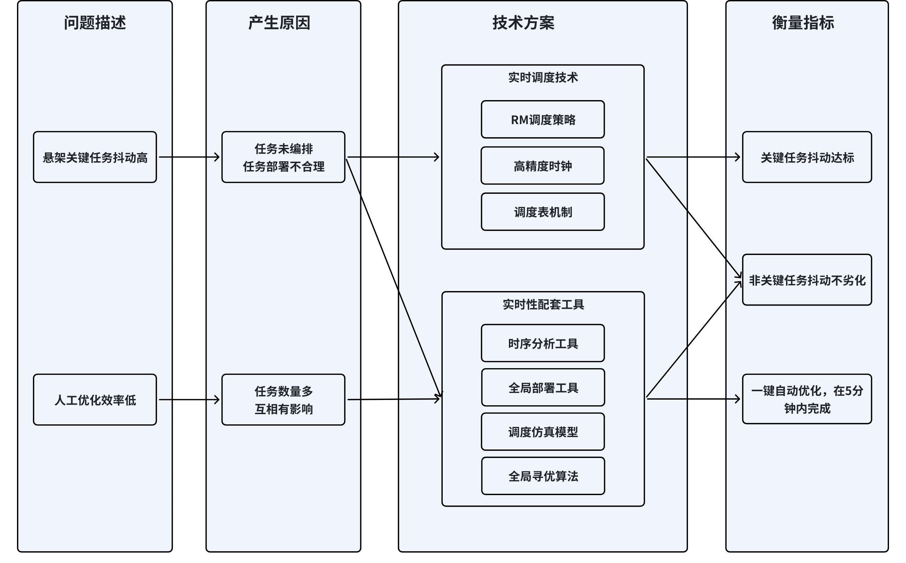
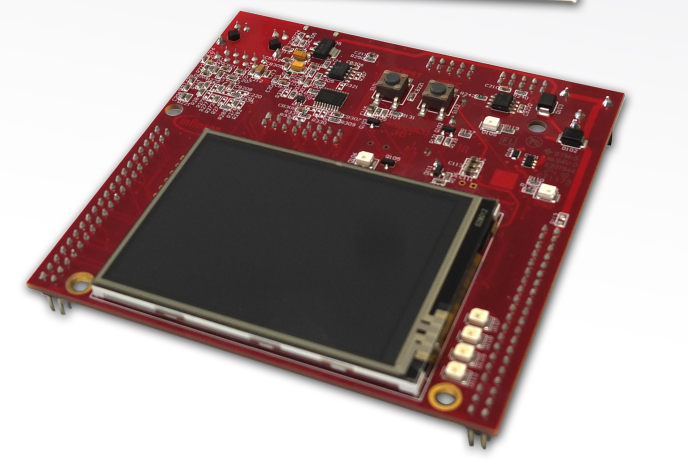
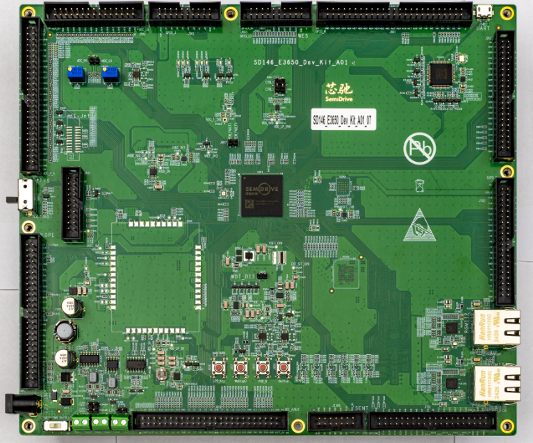
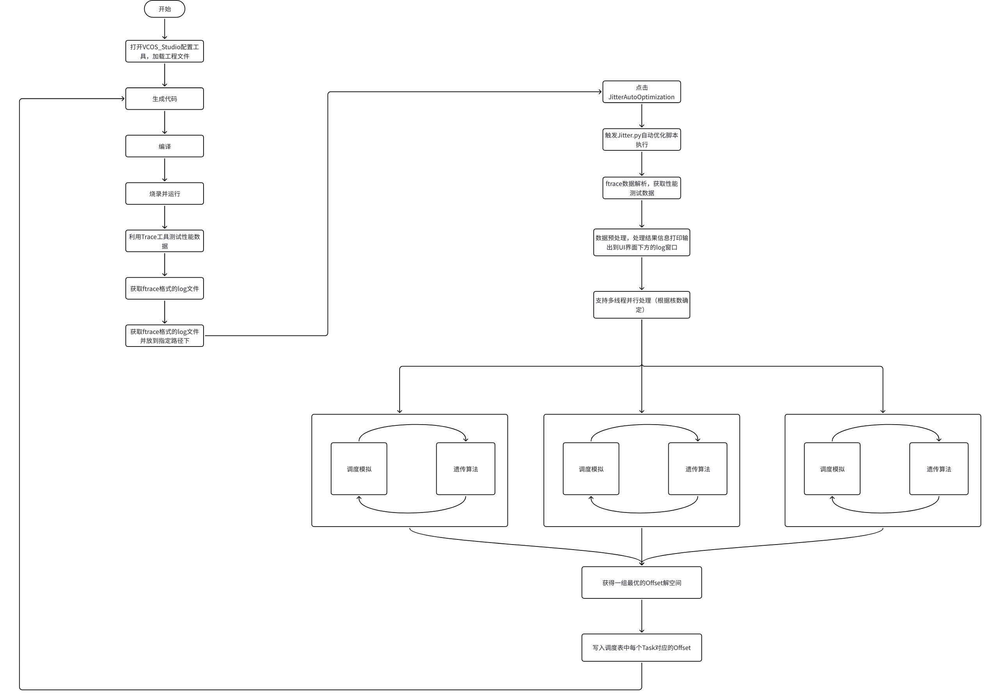

# Key Periodic Task Real-Time Solution Practice

## 1. Application Scenario

To provide passengers with an exceptionally smooth and comfortable driving experience, Li Auto has developed the [Magic Carpet Air Suspension](https://www.lixiang.com/tech/suspension#li). This system can adjust the stiffness of air springs and the damping characteristics of shock absorbers in real time based on different driving conditions and road surfaces, thereby eliminating vibrations and bumps caused by uneven roads. It also features millisecond-level response capabilities. The control of the Magic Carpet Air Suspension places extremely high real-time requirements on the operating system. Its processing algorithm is a 1ms periodic task, requiring task period jitter to be controlled within 100μs to achieve more precise control and smoother suspension responses.

In domain controllers that include air suspension functionality, there may be over 100 tasks running simultaneously. Improving system real-time performance requires addressing the following issues:
- **High task period jitter**: Random task deployment may introduce jitter, requiring optimization of scheduling strategies.
- **Low efficiency of manual optimization**: With a large number of tasks interfering with each other, optimizing the jitter of a single task may increase the jitter of other tasks. This requires global coordination. Manual optimization often requires multiple iterations, resulting in low efficiency.

## 2. Demonstration Goals

+ **Task Jitter Performance Comparison**
    - **Without Task Scheduling**: The 1ms periodic task (key suspension algorithm task) has a jitter of 300μs, exceeding the required threshold.
    - **After Scheduling Optimization**: Using VCOS real-time scheduling technology, the jitter of key tasks is reduced to within 100μs, meeting the requirements. Non-key task jitter metrics remain unaffected.

+ **Optimization Efficiency Comparison**
    - **Traditional Manual Optimization Process**: A single iteration involves timing analysis (30 minutes), task offset adjustment (10 minutes), and compilation, flashing, and verification (20 minutes). Due to task interference, multiple adjustments are required (average of 10 iterations), with a total time of approximately 600 minutes (about one workday).
    - **VCOS Configuration Tool Optimization**: Based on a scheduling simulation model, the algorithm automatically searches for the optimal solution (10,000 iterations), generating a near-optimal solution in just 5 minutes.

## 3. Technical Solution



The real-time performance goals are achieved through the following key technologies:
- **Real-Time Scheduling Technology**
  - **RM Scheduling Strategy**: Analyze system schedulability based on the Rate-Monotonic scheduling strategy to avoid periodic jitter caused by unschedulable tasks.
  - **High-Precision Clock**: Use a high-precision clock to provide nanosecond-level accurate scheduling, enabling finer allocation of scheduling points and reducing jitter caused by task preemption.
  - **Scheduling Table Mechanism**: Deploy suspension-related tasks in a single scheduling table to ensure strict timing execution and reduce uncertainty-induced jitter.

- **Real-Time Supporting Tools**
  - **Timing Analysis Tool**: Use FTRACE to collect system-wide task data (e.g., execution time CET, response time RT, jitter JIT) and allocate time budgets based on measured results.
  - **Global Configuration Tool**: Configure system parameters such as tasks, interrupts, execution cores, deadline constraints, and end-to-end delays. Accepts input via UI or XML, automatically generates C code, improves development efficiency, and reduces coding errors. Supports exporting deployment overviews to optimization algorithms and writing back results from optimization algorithms.
  - **Global Optimization Algorithm**: Based on the deployment overview from the global configuration tool and task execution times from the timing analysis tool, a heuristic algorithm is used to globally optimize for jitter constraints, schedulability constraints, and end-to-end event chain constraints, finding the optimal configuration.
  - **Scheduling Simulation Model**: The global optimization algorithm requires tens of thousands of iterations to search for the optimal configuration. Hardware-based validation for each parameter iteration takes several minutes, and tens of thousands of iterations would take days. To improve optimization efficiency, a simulation model is used to simulate scheduling behavior. Without flashing, the scheduling simulation model is built on a PC to simulate the impact of configuration changes on timing, completing tens of thousands of iterations in just 5 minutes.

## 4. Case Practice

### 4.1. Test Environment
Hardware Environment:
| Development Board Name       | Board Description                                                                 | Purchase Link                                                                 |
|:-----------------------------|:----------------------------------------------------------------------------------|:-----------------------------------------------------------------------------:|
| Infineon TC397 Demo Board  | Infineon's TriCore evaluation board is a powerful development and testing platform equipped with the TC3X7 series AURIX™ 2G controller (TC397, TC387), packaged in LFBGA-292. This evaluation board is designed for rapid prototyping and functional verification, making it an ideal choice for engineers developing innovative applications. | [Link](https://www.infineon.com/cms/en/product/evaluation-boards/kit_a2g_tc397xa_3v3_tft/) |
| SemiDrive E3650 Demo Board  | (4+4) x R52+, 600MHz Low Power Core, HSM core, 5MB SRAM, 16MB + 512KB eNVM BGA495 | [Link](https://support.semidrive.com/product/detail/22) |

Software Configuration:
Refer to the Quick Start section for environment setup. [Compilation](../quick_start/02_compiling.md), [Execution](../quick_start/03_running.md).

### 4.2. Operation Process
The overall operation process is shown in the following flowchart:


#### 4.2.1. Compile, Flash, and Run the `rt_demo` Project
- On Windows, double-click `/vcos/vcos_studio/configurator/configurator.bat` to open the UI interface.
- On Linux, run `./vcos/vcos_studio/configurator/configurator.sh` to open the UI interface.
- Load the configuration file for the demo project located at `/apps/rt_demo/platform_cfg/tc397_cfg.vcosproject`. 
For the steps to generate code, [compile](../quick_start/02_compiling.md), and [run](../quick_start/03_running.md), refer to the "Quick Start" section.


#### 4.2.2. Use Trace to Test Performance Data
The jitter optimization feature relies on performance test data, which needs to be collected using the Trace module. For detailed configuration steps, refer to the Real-Time Analysis Tool User Manual. Below is a brief description of how to obtain log files in the `ftrace` format:
- Start data collection by executing the following command in the `/tools/halo_trace` directory:
```python
python ./trace_processor.py -m online -device ./device_conf.json -log ./logs