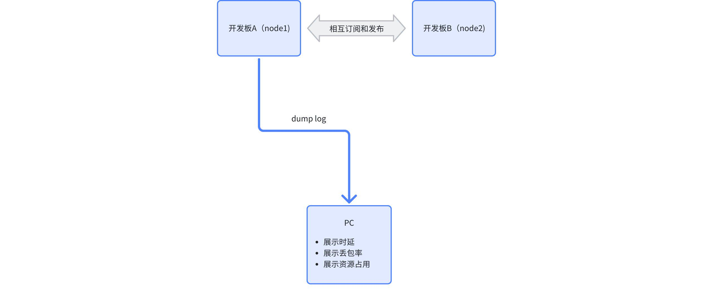
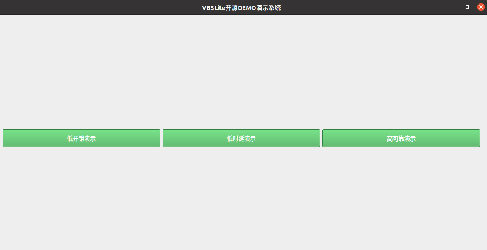
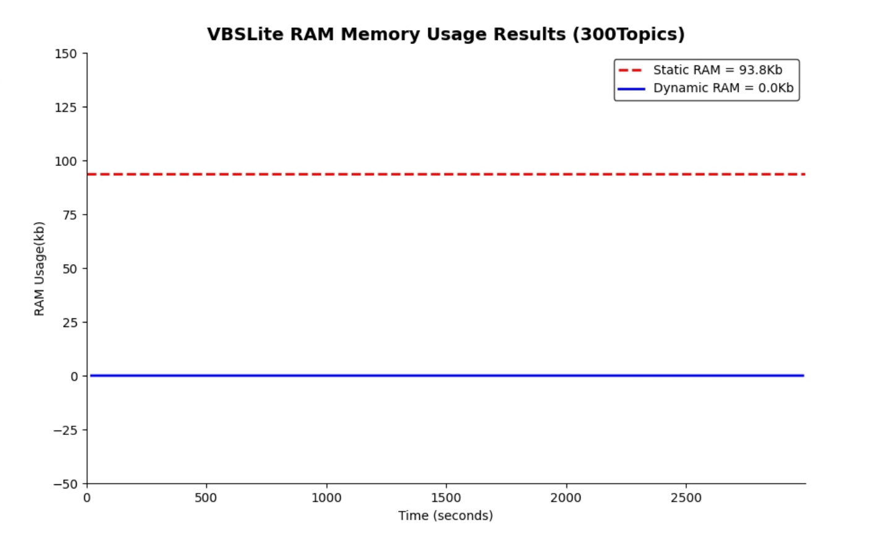
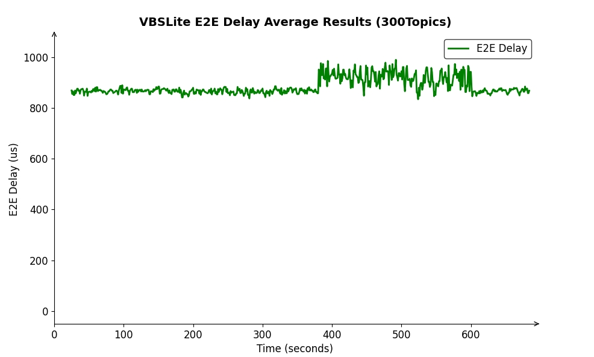
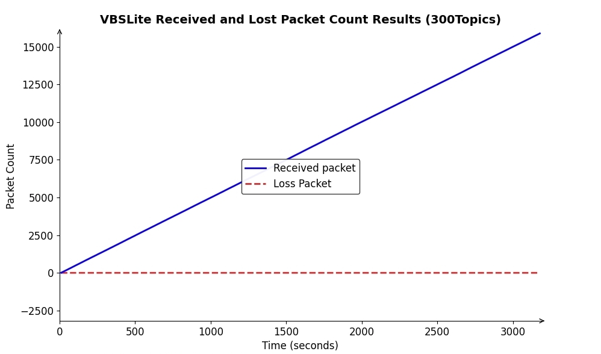

# In-vehicle communication bus lightweight innovation practice

## 1. Application scenarios

In the context of the evolution of automotive electronic and electrical architectures to centralized centralization, communications of traditional distributed ECU architectures face triple rigid constraints:

* Resource Shackles: The mainstream DDS protocol stack resource occupies a high level, making it difficult for automotive-grade MCU surplus resources to support the rapidly growing business demand
* Real-time divide: The wireless control system requires end-to-end delay ≤1ms, while the reliability and time delay of traditional SOME/IP protocol stack is difficult to meet the requirements
* Bandwidth crisis: The bandwidth required for intelligent innovative applications far exceeds the CAN/LIN bus carrying limit, and vehicle-mounted Ethernet accelerates penetration with high bandwidth capabilities

In this context, the VBS open source communication bus achieves breakthrough improvements through architecture-level optimization and achieves performance jumps:

* Low overhead: Single node can carry 300+ communication endpoints (Topic)
* Low latency: Key data P99 delay ≤1ms
* Highly reliable: Reliable service 0 packet loss

This demo focuses on demonstrating three important indicators: low overhead, certainty and reliability

## 2. Demonstrate the goal

* Low overhead

By successfully deploying 300 communication topics on the MCU, VBSLite has shown extremely low memory usage, significantly improving resource utilization efficiency

* Low delay

Verify VBSLite with end-to-end delay test to provide excellent low latency performance to meet the strict demands of real-time applications for fast response

* Highly reliable

Through the MCU packet loss rate test results, VBSLite data transmission is stable and reliable, effectively ensuring that the communication process is not interrupted, realizing zero packet loss for business data, and adapting to diverse application scenarios

## 3. Technical Solution

VBSLite breaks through the traditional DDS implementation paradigm for vehicle control MCU resource constraints, and achieves low overhead, low latency and high reliability communication performance through three innovative technology paths.

1. **Low RAM consumption**

- XML-driven development

Users use XML to define communication matrix and resource specifications, and generate data required by the protocol stack through code generators, avoiding the overhead of dynamic resource allocation at runtime and the uncertainty caused by memory fragmentation.

- Resource pre-allocation strategy

Only deploy data that needs to be dynamically modified at runtime to RAM, and other data to ROM, significantly reducing RAM memory usage

- Protocol implementation breaks through the inherent paradigm

VBSLite no longer stores a lot of buffered data from traditional DDS built-in nodes. When this data is needed, innovatively generates these necessary data through data templates, which not only saves memory, but also controls CPU usage.
2. **Microsecond real-time transmission engine**

- Zero copy transfer mechanism

In the UDP packet collection interrupt processing process, a strategy of directly parsing DDS packets is adopted, eliminating the intermediate links of copying data packets to user tasks, thereby accurately controlling the communication delay to within 100 microseconds, significantly improving data transmission efficiency

- Naked data processing paradigm

For the common fixed-length data in the automotive control field, the traditional serialization/deserialization process is abandoned and the direct copying of data is adopted, which greatly reduces the end-to-end delay.
3. **Enhanced reliability in automotive grade**

- Lightweight and reliable transmission protocol

Retain the DDS core ACK/NACK mechanism

- System-level robust design

Based on the deterministic design concept, it focuses on ensuring the predictability of memory resource use, and fully adopts O (1) constant-level search algorithms within the system to effectively enhance the stability and anti-interference ability of the system operation, and effectively improve overall robustness.

## 4. Case practice

### 4.1. Hardware environment deployment

Based on two development boards for verification, one development board is connected to the PC through a serial port or network, and the data collected through the PC side shows the resource overhead and communication performance of MVBS.

### 4.2. Software Dependency Library

Since DEMO needs to run python scripts during the demonstration process to monitor and demonstrate performance in real time, the following python libraries may also be needed before the demonstration:

* PySide2 == 5.15.2.1
* matplotlib == 3.7.2
* numpy == 1.23.5

### 4.3 Low overhead demonstration

#### 4.3.1. demo design

On mainstream MCU domain controllers, RAM resources are very tight, usually no more than 10M.VBSLite is based on the principle of memory streamlining and determinability. After the business configuration XML and communication matrix IDL are determined, the memory consumption is determined. Memory calculations are only required after compilation is completed. During the run, the memory will not generate any dynamic Malloc memory.

Total RAM consumption = Static RAM + Dynamic RAM

1. Deploy nodes:
- Development Board A releases topic1-topic150, and subscribes to topic151-topic300 released by board B, with a total of 300 communication endpoints
- Development Board B releases topic151-topic300, and subscribes to topic1-topic150 released by board A, with a total of 300 communication endpoints
2. Data size

topic size ranges from 4-1000Byte
3. Send cycle

The data generation period ranges from 50ms to 2000ms
4. Communication QoS

All topics are used by default qos

#### 4.3.2. Operation process

1. Flashing (optional)

If it is the first operation, you need to first brush the compiled firmware into two development boards. After the board is powered on, you will directly run the demo and start periodically printing the LOG. For specific tutorials, please refer to [Compilation] (https://gitee.com/haloos/docs/blob/master/quick_start/02_compiling.md) and [Running] (https://gitee.com/haloos/docs/blob/master/quick_start/03_running.md). If it is a board that has successfully brushed the firmware, you can skip this step and directly watch the demo results.
2. Save the log output from the development board serial port to the log file in real time, such as log.txt.
3. Run the VBSLite_open_source_demo_system.py script. This script requires the above log file as input to open the VBSLite open source DEMO demonstration system. The page is shown in the figure below:

4. Click the "**Low Overhead Demo**" button

Notice:

- You can also directly run the monitor_vbslite_ram_usage.py script when watching the memory results, and you also need to pass in the log file;
- Since static memory computing involves compiling and generating products, the calculation tool provides a default directory. If it needs to be ported, you need to modify the tool script yourself.

#### 4.3.3. Results Display

The expected results are shown in the figure below:

### 4.4 Low Delay Demonstration

#### 4.4.1. demo design

Referring to the ddsperf test method of Cyclonedds, select 2 of the above 300 topics to perform delay testing on the topic based on Round-Trip Time (RTT) test method. The test steps are as follows:

1. First get the current timestamp T1 in development board 1 and assign it to time_ns in Topic1. At the same time, pub1 will send the data to development board 2.
2. After sub1 receives the data in development board 2, it will immediately assign T1 to the time_ns of Topic2, and at the same time, pub2 sends the data back to development board 1.
3. After receiving the data in development board 1, sub2 records the timestamp T2 and parses T1, the end-to-end delay is (T2-T1)/2

#### 4.4.2. Operation process

1. Flashing (optional)

**Reference 4.3.2-1**

2. Open the VBSLite open source DEMO demonstration system and click the "**Low Delay Demo**" button

**Reference 4.3.2-3**

Notice:

- You can also directly run the monitor_vbslite_e2e_lateency.py script when viewing the delay result, and you also need to pass in the log file

#### 4.4.3. Results Display

The expected results are shown in the figure below:

### 4.5 Highly reliable demonstration

#### 4.5.1. demo design

Select a pair of Topics from the above 300 Topics for packet loss rate testing. The test steps are as follows:

1. Send data periodically by pub in node2, and record the current sequence number SN in each data packet, where SN increases monotonically;
2. After receiving the packet by sub in node1, the SN is parsed and compared with the previous packet, and count the total packet and the number of not received.

#### 4.5.2. Operation process

1. Flashing (optional)

**Reference 4.3.2-1**

2. Open the VBSLite open source DEMO demonstration system and click the "**High Reliable Demo**" button

**Reference 4.3.2-3**

Notice:

- You can also directly run the monitor_vbslite_packet_loss.py script when watching the packet loss results, and you also need to pass in the log file

#### 4.5.3. Results Display

The expected results are shown in the figure below:

